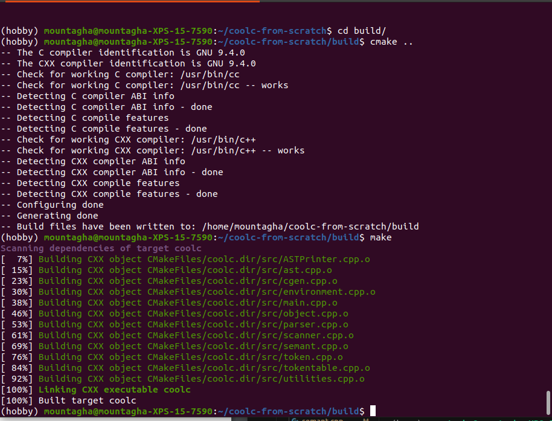

# The COOL Programming Language

## Overview

Cool is a Classroom Object-Oriented Language which contains a fair number of modern programming language features (Abstraction, Static typing, Inheritance, Garbage collection...). Its design is simple enough to allow a single person to write the compiler **YET** complex enough to help one learn all of the concepts underneath compiler construction.

This repository contains the code for building COOL and using it to compile cool files and executes the result binary. The original implementation of cool provided in the classroom uses [Yacc](https://en.wikipedia.org/wiki/Yacc) and [Bison](https://en.wikipedia.org/wiki/GNU_Bison) to  handle the lexing and the parsing phases but in this repo I decide to rewrite the whole phases from scratch in **C++** to make sure I understand all the machinery behind.

## Buid
A simple [CmakeLists.txt](./CMakeLists.txt) is provided to build the project and generate a binary **coolc** that you can use then to compile cool source code.

The COOL compiler generates code in mips so in order to execute the generated code you will need a mips simulator installed on your system. [Spim](https://spimsimulator.sourceforge.net/) is used in this project. You can either use spim in command line or in GUI mode by downloading the [QtSpim](https://spimsimulator.sourceforge.net/). (GUI mode is more suitable for debugging.)

if you opt for the command line mode you will have to replace the default exception handler by the one provided in the lib [trap.handler.s](lib/trap.handler.s) directory which provides the cool runtime environment i.e the startup code, the code for methods of predefined classes (**Object**, **IO**, **String**), the garbage collector and few special procedures need by Cool programs to test objects for equality and handle runtime errors.

## Command line spim use case

